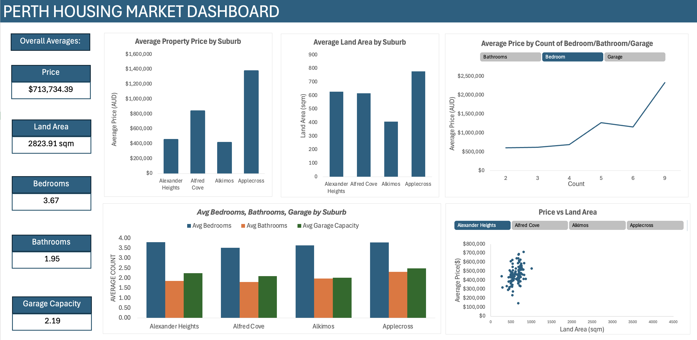

# Perth Housing Market Dashboard
Interactive dashboard analysing property prices, land size, and housing trends across suburbs in Perth.

## Tools
Microsoft Excel, Data Analysis, Dashboard Design

## What I analysed
- Average property prices by suburb
- Average land area by suburb
- Relationship between land area and property price
- Impact of bedrooms, bathrooms, and garage capacity on price
- Overall housing characteristics across suburbs

## Key Insights
- Applecross has the highest average property prices among the suburbs analysed.
- Alkimos shows significantly larger land areas compared to other suburbs.
- Property prices increase with the number of bathrooms and overall property size.
- Larger land areas generally correlate with higher property prices.

## Dashboard

## Outcome
This dashboard provides a quick overview of housing trends across Perth suburbs and helps identify how property features influence market prices.
